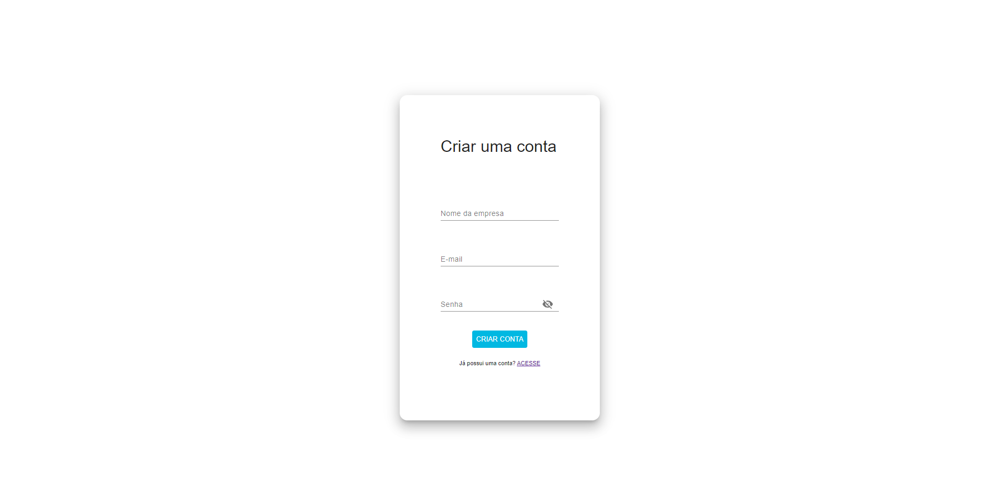
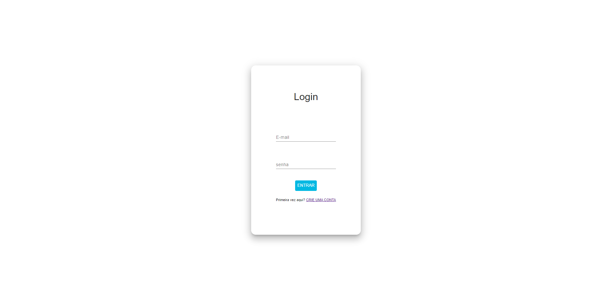
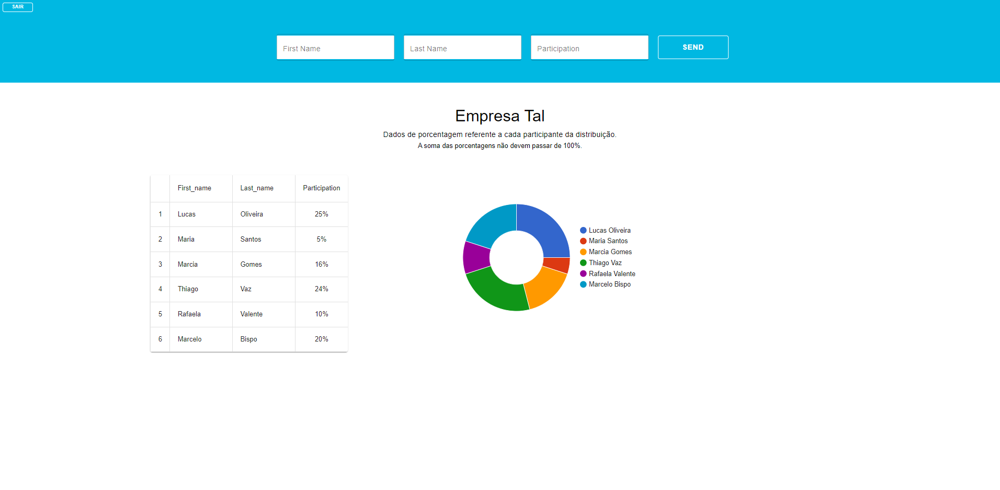
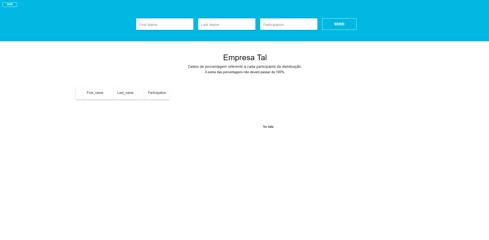

# Challenge Cotabox

Nesse projeto foi desenvolvida uma aplicação em React com 3 páginas: 
- Página de Cadastro (/cadastro);
- Página de Login (/);
- Página de porcentagem de participação de distribuição de uma empresa (/holdings). 

#### `DESENVOLVIMENTO`

- Aplicação foi desenvolvida em React;
- A estilização das páginas foi realizada utilizando o `Material UI`;
- O gráfico foi desenvolvido utilizando a biblioteca `react-google-charts`;

### `DEPLOY`

A aplicação ainda não teve o deploy realizado

Execute a plicação no modo de desenvolvimento, através do comando `npm start` .\
A visualização poderá ser feita no link [http://localhost:3000](http://localhost:3000) através do navegador.

### `SERVIÇOS`

A aplicação se comunica com a API back-challenge-cotabox, através do seguinte link: https://back-challenge-cotabox.up.railway.app. 

## Rotas

#### `/cadastro`

Nessa tela será possível cadastrar uma empresa no na API.

Para isso é necessário:

- Adicionar o nome da empresa;
- Adicionar o e-mail da empresa;
- Adicionar uma senha.

#### `/login`

Nessa tela será possível um empresa cadastrada iniciar o sistema.

Para isso é necessário:

- Informar o e-mail da empresa;
- Informar a senha.

#### `/holdings`

### ATENÇÃO: Está tela é protegida e valida através de token se a empresa é apta a acessá-la ou não.

Nessa é possível visualizar e adicionar as porcentagens de participação de distribuição da empresa logada.

Para adicionar uma porcentagem de participação, deve: 
- Informar o primeiro nome (First Name) do colaborador;
- Informar o último nome (Last Name) do colaborador;
- Informar o valor da porcentagem da participação (Participation);

`IMPORTANTE:` A soma das porcentagens adicionadas não devem passar de 100%. 

Caso a empresa não tenha nenhuma porcentagem adicionada, a tela será exibida como na figura abaixo: 

- Para deslogar basta clicar no botão (`SAIR`), na parte superior do lado esquerdo da tela;